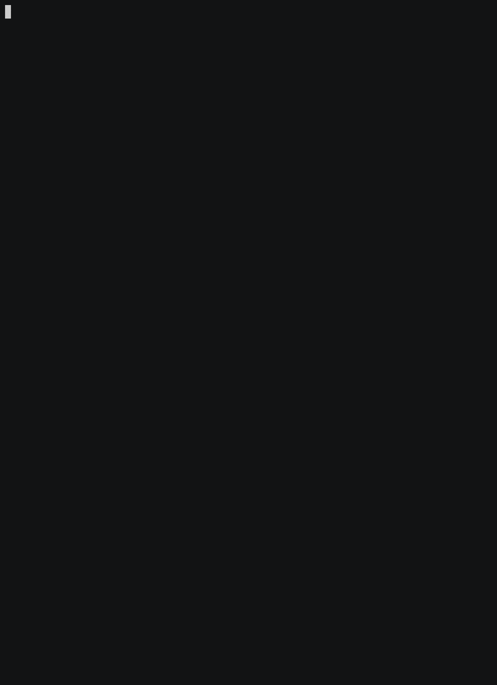

# AWS CloudWatch Logs Source connector



## Objective

Quickly test [AWS CloudWatch Logs](https://docs.confluent.io/current/connect/kafka-connect-aws-cloudwatch-logs/index.html#kconnect-long-aws-cloudwatch-logs-source-connector) connector.

## Pre-requisites

* `docker-compose` (example `brew cask install docker`)


## AWS Setup

* Make sure you have an [AWS account](https://docs.aws.amazon.com/streams/latest/dev/before-you-begin.html#setting-up-sign-up-for-aws).
* Set up [AWS Credentials](https://docs.confluent.io/current/connect/kafka-connect-kinesis/quickstart.html#aws-credentials)

This project assumes `~/.aws/credentials` is set, see `docker-compose.yml`file for connect:

```yaml
    connect:
    <snip>
    volumes:
        - $HOME/.aws/credentials:/root/.aws/credentials:ro
```

## How to run

Simply run:

```bash
$ ./cloudwatch.sh
```


## Details of what the script is doing

Create a log group in AWS CloudWatch Logs.

```bash
$ aws logs create-log-group --log-group my-log-group
```

Create a log stream in AWS CloudWatch Logs.

```bash
$ aws logs create-log-stream --log-group my-log-group --log-stream my-log-stream
```

Insert Records into your log stream.

Note: If this is the first time inserting logs into a new log stream, then no sequence token is needed.
However, after the first put, there will be a sequence token returned that will be needed as a parameter in the next put.

```bash
$ aws logs put-log-events --log-group my-log-group --log-stream my-log-stream --log-events timestamp=`date +%s000`,message="This is a log #0"
```

Injecting more messages

```bash
for i in $(seq 1 10)
do
     token=$($ aws logs describe-log-streams --log-group my-log-group | jq -r .logStreams[0].uploadSequenceToken)
     $ aws logs put-log-events --log-group my-log-group --log-stream my-log-stream --log-events timestamp=`date +%s000`,message="This is a log #${i}" --sequence-token ${token}
done
```

Creating AWS CloudWatch Logs Source connector

```bash
docker exec connect \
     curl -X PUT \
     -H "Content-Type: application/json" \
     --data '{
               "connector.class": "io.confluent.connect.aws.cloudwatch.AwsCloudWatchSourceConnector",
                    "tasks.max": "1",
                    "aws.cloudwatch.logs.url": "https://logs.us-east-1.amazonaws.com",
                    "aws.cloudwatch.log.group": "my-log-group",
                    "aws.cloudwatch.log.streams": "my-log-stream",
                    "confluent.license": "",
                    "confluent.topic.bootstrap.servers": "broker:9092",
                    "confluent.topic.replication.factor": "1"
          }' \
     http://localhost:8083/connectors/aws-cloudwatch-logs-source/config | jq .
```

Verify we have received the data in `my-log-group.my-log-stream` topic

```bash
$ docker exec broker kafka-console-consumer -bootstrap-server broker:9092 --topic my-log-group.my-log-stream --from-beginning --max-messages 10
```

N.B: Control Center is reachable at [http://127.0.0.1:9021](http://127.0.0.1:9021])
