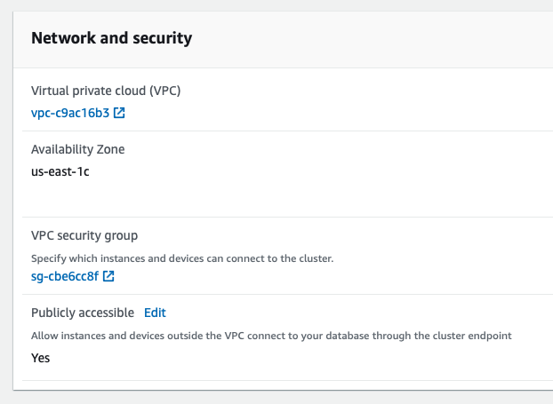

# AWS Redshift Sink connector

## Objective

Quickly test [AWS Redshift](https://docs.confluent.io/current/connect/kafka-connect-aws-redshift/index.html#kconnect-long-aws-redshift-sink-connector) connector.

## Pre-requisites

* `docker-compose` (example `brew cask install docker`)


## AWS Redshift instance setup

Follow steps from [here](https://docs.confluent.io/current/connect/kafka-connect-aws-redshift/index.html#create-an-aws-redshift-instance)

**Make sure to change your cluster security group to include your IP with port `5439`**


**Make sure to make it Publicly accessible**



## How to run

Simply run:

```bash
$ ./redshift.sh <CLUSTER> <PASSWORD>
```

With CLUSTER set with your Redshift cluster endpoint (`cluster-name.cluster-id.region.redshift.amazonaws.com`)

## Details of what the script is doing

Sending messages to topic `orders`

```bash
$ docker exec -i connect kafka-avro-console-producer --broker-list broker:9092 --property schema.registry.url=http://schema-registry:8081 --topic orders --property value.schema='{"type":"record","name":"myrecord","fields":[{"name":"id","type":"int"},{"name":"product", "type": "string"}, {"name":"quantity", "type": "int"}, {"name":"price",
"type": "float"}]}' << EOF
{"id": 999, "product": "foo", "quantity": 100, "price": 50}
EOF
```

Creating AWS Redshift Source connector

```bash
$ docker exec -e PROJECT="$DOMAIN" -e DATASET="$PASSWORD" connect \
     curl -X PUT \
     -H "Content-Type: application/json" \
     --data '{
               "connector.class": "io.confluent.connect.aws.redshift.RedshiftSinkConnector",
                    "tasks.max": "1",
                    "topics": "orders",
                    "aws.redshift.domain": "'"$DOMAIN"'",
                    "aws.redshift.port": "5439",
                    "aws.redshift.database": "dev",
                    "aws.redshift.user": "awsuser",
                    "aws.redshift.password": "'"$PASSWORD"'",
                    "auto.create": "true",
                    "pk.mode": "kafka",
                    "confluent.license": "",
                    "confluent.topic.bootstrap.servers": "broker:9092",
                    "confluent.topic.replication.factor": "1"
          }' \
     http://localhost:8083/connectors/redshift-sink/config | jq .
```

Verify data is in Redshift

```bash
$ docker run -i debezium/postgres:10 psql -h redshift-cluster-1.xxxxx.us-east-1.redshift.amazonaws.com -U awsuser -d dev -p 5439 << EOF
$PASSWORD
SELECT * from orders;
EOF
```

Results:

```
docker run -i debezium/postgres:10 psql -h redshift-cluster-1.xxxxx.us-east-1.redshift.amazonaws.com -U awsuser -d dev -p 5439 << EOF
> $PASSWORD
> SELECT * from orders;
> EOF
Password for user awsuser:
 __connect_topic |             product             | quantity | __connect_partition | __connect_offset | price | id
-----------------+---------------------------------+----------+---------------------+------------------+-------+-----
 orders          | foo                             |      100 |                   0 |                0 |    50 | 999
(1 rows)
```

N.B: Control Center is reachable at [http://127.0.0.1:9021](http://127.0.0.1:9021])
