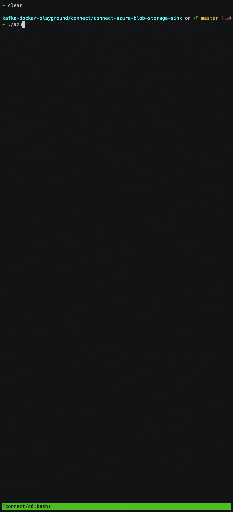

# Azure Blob Storage Sink connector



## Objective

Quickly test [Azure Blob Storage Sink](https://docs.confluent.io/current/connect/kafka-connect-azure-blob-storage/index.html#quick-start) connector.

## Pre-requisites

* `docker-compose` (example `brew cask install docker`)

* `az`(example `brew install azure-cli`)

## How to run

Simply run:

```
$ ./azure-blob-storage.sh
```

## Details of what the script is doing

Logging to Azure using browser (or using environment variables `AZ_USER` and `AZ_PASS` if set)

```bash
az login
```

All the blob storage setup is automated:

```bash
AZURE_RANDOM=$RANDOM
AZURE_RESOURCE_GROUP=delete$AZURE_RANDOM
AZURE_ACCOUNT_NAME=delete$AZURE_RANDOM
AZURE_CONTAINER_NAME=delete$AZURE_RANDOM
AZURE_REGION=westeurope

az group create \
    --name $AZURE_RESOURCE_GROUP \
    --location $AZURE_REGION
az storage account create \
    --name $AZURE_ACCOUNT_NAME \
    --resource-group $AZURE_RESOURCE_GROUP \
    --location $AZURE_REGION \
    --sku Standard_LRS \
    --encryption-services blob
az storage container create \
    --account-name $AZURE_ACCOUNT_NAME \
    --name $AZURE_CONTAINER_NAME
AZURE_ACCOUNT_KEY=$(az storage account keys list \
    --account-name $AZURE_ACCOUNT_NAME \
    --resource-group $AZURE_RESOURCE_GROUP \
    --output table \
    | grep key1 | awk '{print $3}')
```

The connector is created with:

```bash
$ docker exec -e AZURE_ACCOUNT_NAME="$AZURE_ACCOUNT_NAME" -e AZURE_ACCOUNT_KEY="$AZURE_ACCOUNT_KEY" -e AZURE_CONTAINER_NAME="$AZURE_CONTAINER_NAME" connect \
     curl -X PUT \
     -H "Content-Type: application/json" \
     --data '{
               "connector.class": "io.confluent.connect.azure.blob.AzureBlobStorageSinkConnector",
                    "tasks.max": "1",
                    "topics": "blob_topic",
                    "flush.size": "3",
                    "azblob.account.name": "'"$AZURE_ACCOUNT_NAME"'",
                    "azblob.account.key": "'"$AZURE_ACCOUNT_KEY"'",
                    "azblob.container.name": "'"$AZURE_CONTAINER_NAME"'",
                    "format.class": "io.confluent.connect.azure.blob.format.avro.AvroFormat",
                    "confluent.license": "",
                    "confluent.topic.bootstrap.servers": "broker:9092",
                    "confluent.topic.replication.factor": "1"
          }' \
     http://localhost:8083/connectors/azure-blob-sink/config | jq .
```

Messages are sent to `blob_topic` topic using:

```bash
$ seq -f "{\"f1\": \"value%g\"}" 10 | docker exec -i connect kafka-avro-console-producer --broker-list broker:9092 --property schema.registry.url=http://schema-registry:8081 --topic blob_topic --property value.schema='{"type":"record","name":"myrecord","fields":[{"name":"f1","type":"string"}]}'
```

Listing objects of container in Azure Blob Storage:

```bash
$ az storage blob list --account-name "${AZURE_ACCOUNT_NAME}" --account-key "${AZURE_ACCOUNT_KEY}" --container-name "${AZURE_CONTAINER_NAME}" --output table
```

Results:

```
Name                                                        Blob Type    Blob Tier    Length    Content Type              Last Modified              Snapshot
----------------------------------------------------------  -----------  -----------  --------  ------------------------  -------------------------  ----------
topics/blob_topic/partition=0/blob_topic+0+0000000000.avro  BlockBlob    Hot          213       application/octet-stream  2019-11-12T15:20:39+00:00
topics/blob_topic/partition=0/blob_topic+0+0000000003.avro  BlockBlob    Hot          213       application/octet-stream  2019-11-12T15:20:40+00:00
topics/blob_topic/partition=0/blob_topic+0+0000000006.avro  BlockBlob    Hot          213       application/octet-stream  2019-11-12T15:20:40+00:00
```

Getting one of the avro files locally and displaying content with avro-tools:

```bash
$ az storage blob download --account-name "${AZURE_ACCOUNT_NAME}" --account-key "${AZURE_ACCOUNT_KEY}" --container-name "${AZURE_CONTAINER_NAME}" --name topics/blob_topic/partition=0/blob_topic+0+0000000000.avro --file /tmp/blob_topic+0+0000000000.avro
```

Deleting resource group:

```bash
$ az group delete --name $AZURE_RESOURCE_GROUP --yes
```

N.B: Control Center is reachable at [http://127.0.0.1:9021](http://127.0.0.1:9021])
