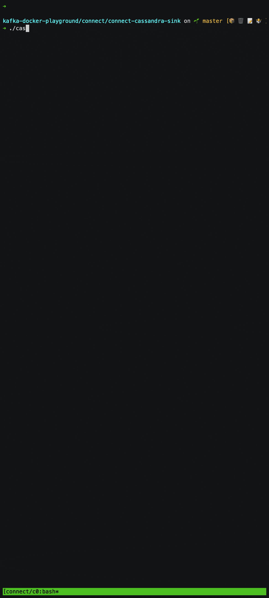

# Cassandra Sink connector



## Objective

Quickly test [Cassandra Sink](https://docs.confluent.io/current/connect/kafka-connect-cassandra/index.html#kconnect-long-cassandra-sink-connector) connector.

Cassandra `3.0` is used.

## Pre-requisites

* `docker-compose` (example `brew cask install docker`)


## How to run

Simply run:

```
$ ./cassandra.sh
```

## Details of what the script is doing

Sending messages to topic topic1

```bash
$ seq -f "{\"f1\": \"value%g\"}" 10 | docker exec -i connect kafka-avro-console-producer --broker-list broker:9092 --property schema.registry.url=http://schema-registry:8081 --topic topic1 --property value.schema='{"type":"record","name":"myrecord","fields":[{"name":"f1","type":"string"}]}'
```

Creating Cassandra Sink connector

```bash
$ docker exec connect \
     curl -X PUT \
     -H "Content-Type: application/json" \
     --data '{
               "connector.class": "io.confluent.connect.cassandra.CassandraSinkConnector",
                    "tasks.max": "1",
                    "topics" : "topic1",
                    "cassandra.contact.points" : "cassandra",
                    "cassandra.keyspace" : "test",
                    "cassandra.consistency.level": "ONE",
                    "confluent.license": "",
                    "confluent.topic.bootstrap.servers": "broker:9092",
                    "confluent.topic.replication.factor": "1",
                    "transforms": "createKey",
                    "transforms.createKey.fields": "f1",
                    "transforms.createKey.type": "org.apache.kafka.connect.transforms.ValueToKey"
          }' \
     http://localhost:8083/connectors/cassandra-sink/config | jq .
```

Verify messages are in cassandra table test.topic1

```bash
$ docker exec cassandra cqlsh -e 'select * from test.topic1;'
```

Results:

```bash
 f1
---------
  value7
  value9
  value6
  value1
  value8
  value3
  value5
  value4
  value2
 value10

(10 rows)
```

N.B: Control Center is reachable at [http://127.0.0.1:9021](http://127.0.0.1:9021])
