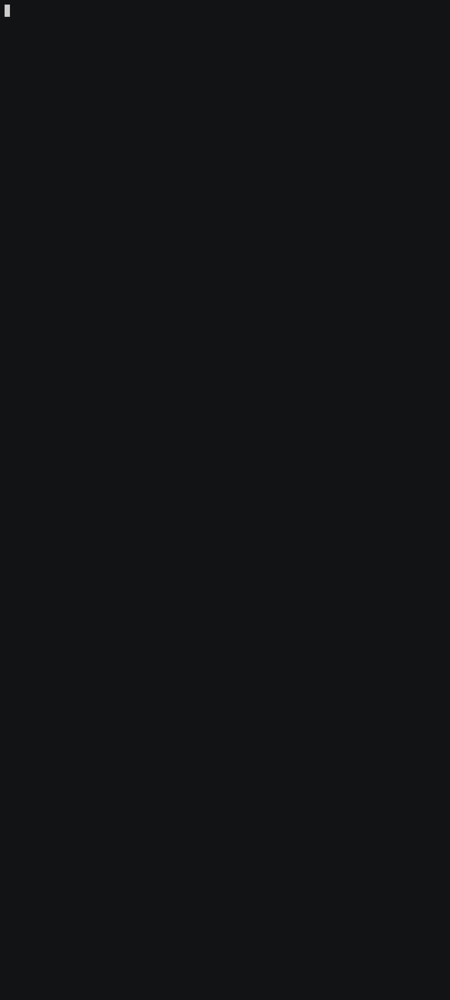

# HDFS 3 Sink connector



## Objective

Quickly test [HDFS 3 Sink](https://docs.confluent.io/current/connect/kafka-connect-hdfs/hdfs3/index.html#kconnect-long-hdfs-3-sink-connector) connector.


## How to run

Simply run:

```
$ ./hdfs3-sink.sh
```

## Details of what the script is doing

Note in this simple example, if you get into an issue with permissions at the local HDFS level, it may be easiest to unlock the permissions unless you want to debug that more.

```bash
$ docker exec namenode bash -c "/opt/hadoop-3.1.3/bin/hdfs dfs -chmod 777  /"
```

The connector is created with:

```bash
$ docker exec connect \
     curl -X PUT \
     -H "Content-Type: application/json" \
     --data '{
        "connector.class":"io.confluent.connect.hdfs3.Hdfs3SinkConnector",
               "tasks.max":"1",
               "topics":"test_hdfs",
               "hdfs.url":"hdfs://namenode:9000",
               "flush.size":"3",
               "hadoop.conf.dir":"/etc/hadoop/",
               "partitioner.class":"io.confluent.connect.storage.partitioner.FieldPartitioner",
               "partition.field.name":"f1",
               "rotate.interval.ms":"120000",
               "hadoop.home":"/opt/hadoop-3.1.3/share/hadoop/common",
               "logs.dir":"/tmp",
               "key.converter":"org.apache.kafka.connect.storage.StringConverter",
               "value.converter":"io.confluent.connect.avro.AvroConverter",
               "value.converter.schema.registry.url":"http://schema-registry:8081",
               "schema.compatibility":"BACKWARD"
          }' \
     http://localhost:8083/connectors/hdfs3-sink/config | jq .
```

Messages are sent to `test_hdfs` topic using:

```
$ seq -f "{\"f1\": \"value%g\"}" 10 | docker exec -i connect kafka-avro-console-producer --broker-list broker:9092 --property schema.registry.url=http://schema-registry:8081 --topic test_hdfs --property value.schema='{"type":"record","name":"myrecord","fields":[{"name":"f1","type":"string"}]}'
```

After a few seconds, HDFS should contain files in /topics/test_hdfs:

```
$ docker exec namenode bash -c "/opt/hadoop-3.1.3/bin/hdfs dfs -ls /topics/test_hdfs"

drwxr-xr-x   - root supergroup          0 2019-10-25 08:19 /topics/test_hdfs/f1=value1
drwxr-xr-x   - root supergroup          0 2019-10-25 08:19 /topics/test_hdfs/f1=value2
drwxr-xr-x   - root supergroup          0 2019-10-25 08:19 /topics/test_hdfs/f1=value3
drwxr-xr-x   - root supergroup          0 2019-10-25 08:19 /topics/test_hdfs/f1=value4
drwxr-xr-x   - root supergroup          0 2019-10-25 08:19 /topics/test_hdfs/f1=value5
drwxr-xr-x   - root supergroup          0 2019-10-25 08:19 /topics/test_hdfs/f1=value6
drwxr-xr-x   - root supergroup          0 2019-10-25 08:19 /topics/test_hdfs/f1=value7
drwxr-xr-x   - root supergroup          0 2019-10-25 08:19 /topics/test_hdfs/f1=value8
drwxr-xr-x   - root supergroup          0 2019-10-25 08:19 /topics/test_hdfs/f1=value9
```

N.B: Control Center is reachable at [http://127.0.0.1:9021](http://127.0.0.1:9021])
