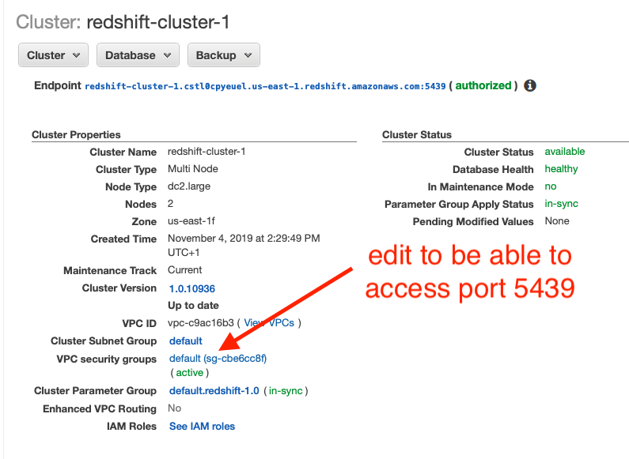

# JDBC AWS Redshift source connector

## Objective

Quickly test [JDBC Source](https://docs.confluent.io/current/connect/kafka-connect-jdbc/source-connector/index.html) connector with AWS Redshift.

## Pre-requisites

* `docker-compose` (example `brew cask install docker`)


## AWS Redshift instance setup

Follow steps from [here](https://docs.confluent.io/current/connect/kafka-connect-aws-redshift/index.html#create-an-aws-redshift-instance)

**Make sure to change your cluster security group to include your IP with port `5439`**



**Make sure to make it Publicly accessible**


## How to run

Simply run:

```bash
$ ./redshift.sh <CLUSTER> <PASSWORD>
```

With CLUSTER set with your Redshift cluster endpoint (`cluster-name.cluster-id.region.redshift.amazonaws.com`)

If you want to use IAM credentials:

```bash
$ ./redshift-iam.sh <CLUSTER> <PASSWORD> <AccessKeyID> <SecretAccessKey>
```

## Details of what the script is doing

Create database in Redshift

```bash
$ docker run -i -e CLUSTER="$CLUSTER" -e USER="$USER" -e DATABASE="$DATABASE" -e PORT="$PORT" -e PASSWORD="$PASSWORD" -v "${DIR}/customers.sql":/tmp/customers.sql debezium/postgres:10 psql -h "$CLUSTER" -U "$USER" -d "$DATABASE" -p "$PORT" -f "/tmp/customers.sql" << EOF
$PASSWORD
EOF
```

Verify data is in Redshift

```bash
$ docker run -i -e CLUSTER="$CLUSTER" -e USER="$USER" -e DATABASE="$DATABASE" -e PORT="$PORT" -e PASSWORD="$PASSWORD" -v "${DIR}/customers.sql":/tmp/customers.sql debezium/postgres:10 psql -h "$CLUSTER" -U "$USER" -d "$DATABASE" -p "$PORT" << EOF
$PASSWORD
SELECT * from CUSTOMERS;
EOF
```

Creating JDBC AWS Redshift source connector

```bash
$ docker exec connect \
     curl -X PUT \
     -H "Content-Type: application/json" \
     --data '{
               "connector.class": "io.confluent.connect.jdbc.JdbcSourceConnector",
                    "tasks.max": "1",
                    "connection.url": "jdbc:postgresql://'"$CLUSTER"':'"$PORT"'/'"$DATABASE"'?user='"$USER"'&password='"$PASSWORD"'&ssl=false",
                    "table.whitelist": "customers",
                    "mode": "timestamp+incrementing",
                    "timestamp.column.name": "update_ts",
                    "incrementing.column.name": "id",
                    "topic.prefix": "redshift-",
                    "validate.non.null":"false",
                    "errors.log.enable": "true",
                    "errors.log.include.messages": "true"
          }' \
     http://localhost:8083/connectors/redshift-source/config | jq_docker_cli .
```

Verifying topic `redshift-customers`

```bash
$ timeout 60 docker exec connect kafka-avro-console-consumer -bootstrap-server broker:9092 --property schema.registry.url=http://schema-registry:8081 --topic redshift-customers --from-beginning --max-messages 5
```

Result is:

```json
{
    "club_status": {
        "string": "bronze"
    },
    "comments": {
        "string": "Universal optimal hierarchy"
    },
    "create_ts": {
        "long": 1580230824909
    },
    "email": {
        "string": "rblaisdell0@rambler.ru"
    },
    "first_name": {
        "string": "Rica"
    },
    "gender": {
        "string": "Female"
    },
    "id": 1,
    "last_name": {
        "string": "Blaisdell"
    },
    "update_ts": {
        "long": 1580230824909
    }
}
```

N.B: Control Center is reachable at [http://127.0.0.1:9021](http://127.0.0.1:9021])
