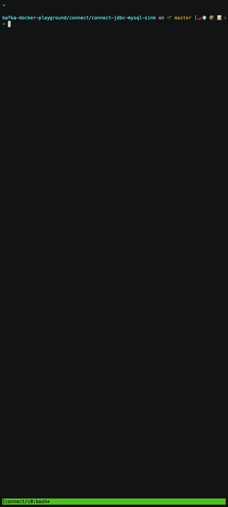

# JDBC MySQL Sink connector



## Objective

Quickly test [JDBC Sink](https://docs.confluent.io/current/connect/kafka-connect-jdbc/sink-connector/index.html#quick-start) connector with MySQL.

## Pre-requisites

* `docker-compose` (example `brew cask install docker`)


## How to run

Simply run:

```
$ ./mysql-sink.sh
```

## Details of what the script is doing

Creating MySQL sink connector

```bash
$ docker exec connect \
     curl -X PUT \
     -H "Content-Type: application/json" \
     --data '{
               "connector.class": "io.confluent.connect.jdbc.JdbcSinkConnector",
                    "tasks.max": "1",
                    "connection.url": "jdbc:mysql://mysql:3306/db?user=user&password=password&useSSL=false",
                    "topics": "orders",
                    "auto.create": "true"
          }' \
     http://localhost:8083/connectors/mysql-sink/config | jq .
```

Sending messages to topic orders

```bash
$ docker exec -i connect kafka-avro-console-producer --broker-list broker:9092 --property schema.registry.url=http://schema-registry:8081 --topic orders --property value.schema='{"type":"record","name":"myrecord","fields":[{"name":"id","type":"int"},{"name":"product", "type": "string"}, {"name":"quantity", "type": "int"}, {"name":"price",
"type": "float"}]}' << EOF
{"id": 999, "product": "foo", "quantity": 100, "price": 50}
EOF
```


Describing the `orders` table in DB `db`:

```bash
$ docker exec mysql bash -c "mysql --user=root --password=password --database=db -e 'describe orders'"
```

Results:
```
Field   Type    Null    Key     Default Extra
product varchar(256)    NO              NULL
quantity        int(11) NO              NULL
price   float   NO              NULL
id      int(11) NO              NULL
```

Show content of `orders` table:

```bash
$ docker exec mysql bash -c "mysql --user=root --password=password --database=db -e 'select * from orders'"
```

Results:

```
product quantity        price   id
foo     100     50      999
```

N.B: Control Center is reachable at [http://127.0.0.1:9021](http://127.0.0.1:9021])
